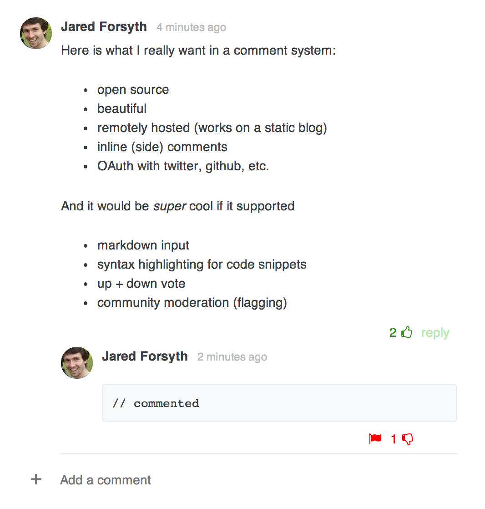

# // Commented

## Comments done simple

> Imagine disqus + medium in an open source library that's both beautiful
> and easy to use.



## Features

- you own your data. *[why is this important?](#own-your-data)*
- login with twitter, github, google, or facebook
- comments at the bottom
- up + down voting, flagging
- (soon) inline comments to the side

## Quickstart

- create a [firebase app](https://www.firebase.com/)
- create the appropriate [facebook](https://www.firebase.com/docs/security/simple-login-facebook.html), [google](https://www.firebase.com/docs/security/simple-login-google.html), [twitter](https://www.firebase.com/docs/security/simple-login-twitter.html), and [github](https://www.firebase.com/docs/security/simple-login-github.html) apps. 
- load the [scripts &amp; styles](#deps)
- put the following snippet wherever you want the comments to appear

```html
<div
  data-firebase="my-firebase-app"             // or whatever the slug is
  data-auth="facebook google twitter github"  // or some subset of these
  data-slug="{{ post.slug }}"                 // some unique string to identify this page. Defaults to the full URL
  id="commented-main"></div>
```


<a name="deps"></a>
## Dependencies

- [React](http://facebook.github.io/react/)
- [FontAwesome](http://fontawesome.io/)
- [Firebase](https://www.firebase.com/docs/) &amp; [FirebaseSimpleLogin](https://www.firebase.com/docs/security/simple-login-overview.html)
- [Marked](https://github.com/chjj/marked) **optional** if you want markdown rendering
- [Moment](momentjs.com)

The scripts (at the bottom of the `<body>`)
```html
<script src="//cdn.firebase.com/v0/firebase.js"></script>
<script src="//cdn.firebase.com/js/simple-login/1.6.1/firebase-simple-login.js"></script>
<script src="//cdnjs.cloudflare.com/ajax/libs/react/0.10.0/react-with-addons.js"></script>
<script src="//cdnjs.cloudflare.com/ajax/libs/moment.js/2.7.0/moment.min.js"></script>
<script src="//cdnjs.cloudflare.com/ajax/libs/marked/0.3.2/marked.min.js"></script> <!-- this is optional -->
<script src="/path/to/commented.min.js"></script>
```

The styles
```html
<link href="//maxcdn.bootstrapcdn.com/font-awesome/4.1.0/css/font-awesome.min.css" rel="stylesheet">
<link href="/path/to/commented.min.css" rel="stylesheet">
```

<a name="own-your-data"></a>
## Why is it cool to own your data?

The issue with free hosted services is their business model is often
**monetize your data** and the data of your visitors. Often, it is more
advantageous for them to invest in their ad platform than to improve the user
experience for you and your visitors.

With // Commented, you have complete control.

## Roadmap

- put together a [Hood.ie](http://hood.ie) backend
- syntax highlighting
- cdnjs submission
- Admin tools for moderation, banning, etc.

